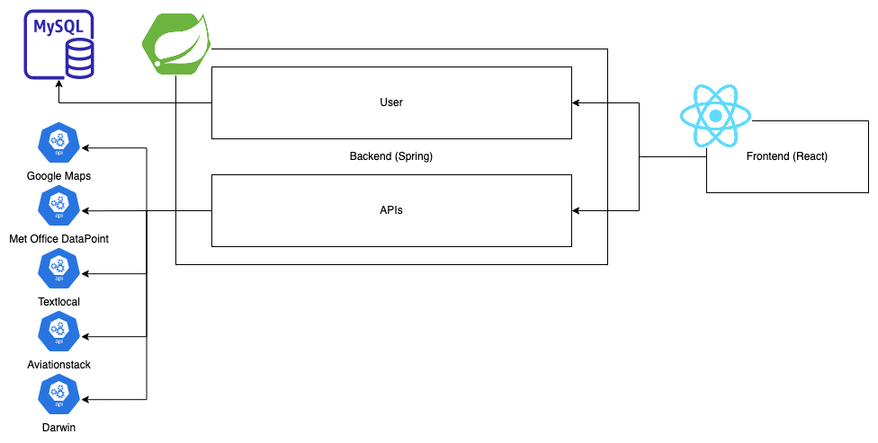
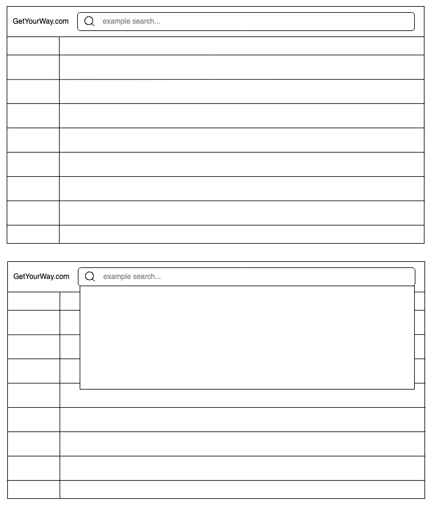

# Skynet

## Project
### Standards/Practices

- All tickets are derived from a requirement in the product backlog

- Tests for every ticket 

- For every ticket with estimated effort >= 3 (or for a set of tickets with a combined effort >=3):
  - a new branch must be created, when done run tests, run formatter, submit a PR, one other person reviews
 
- Write Java doc comments above every (public, protected, default) method in a class, plus every class

- Commit messages must observe the following convention: "[\<issue number\>] \<brief description of changes\>"
 
### Scrum

2 sprints, Mon 3 - Tue 4, Wed 4 - Thur 5, (then presentation stuff)
scrum master rotates every 2 days (cycle Adam, Harry, Selina, Kalyan, Ganesh)

### Miscellanous

- Make notes (give examples) regarding how in our code we have:
  - given general consideration for OWASP.
  - "" code quality/principles/etc.
    

### Meta Requirements 
- [ ] list of stakeholders 
- [ ] formal requirements
- [ ] design documentation (class diagrams, wire frames)
- [ ] development breakdown
- [ ] tools and frameworks
- [ ] technical specifications
- [ ] test methodology and results 
- [ ] follow-up documentation; process improvement
- [ ] future developments and extensibility of the application
- [ ] scrum boards
- [ ] retrospective and review boards

## Documentation

### APIs

Met Office DataPoint (Weather): https://www.metoffice.gov.uk/services/data/datapoint/datapoint-documentation

Open-Meteo (Weather): https://open-meteo.com/en/docs

Google Maps (Maps): https://developers.google.com/maps/documentation

Textlocal (SMS): https://api.txtlocal.com/docs/

Skyscanner (Flight): https://developers.skyscanner.net/docs/intro

Aviationstack (Flight): https://aviationstack.com/documentation

Darwin (Rail): https://www.nationalrail.co.uk/developers/darwin-data-feeds/

### System Architecture

### MVP

Home:
- Static EPG of channels
  - Hyperlink to related programme page
    - On hover "See programme information" (or similar)
    - Add button on each programme
- Search bar
  - List of options
- GetYourWay.com logo

User:
- Display User Profile
  - Display user's profile information.
  - Display saved flights/programme
  - (stretch) Allow users to update account info.
- log in/sign up

Programme:
- Programme details
- Location selector
  - Interactive Map: Display map with pins at source and target
- Date selector
- Display Flight information from the Api 
- Weather Information: forecast for source and target destination

